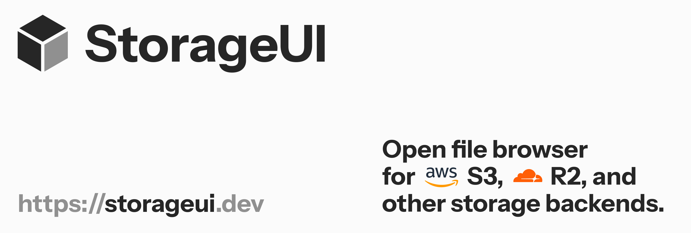

# Storage UI

<p align="start">
  <a href="https://cloud.dify.ai">Website</a> ·
  <a href="https://docs.dify.ai/getting-started/install-self-hosted">Self-hosting</a> ·
  <a href="https://docs.dify.ai">Documentation</a> ·
</p>

A browser-based, Finder-style file explorer for AWS S3, Cloudflare R2, Alibaba
Cloud OSS, Tencent Cloud COS, Backblaze B2, and other S3-compatible object
storage. Built with Next.js and Extend UI.

## Features

- Icon, list, column, and gallery views
- Search, filtering, sorting, and lazy folder loading
- PDF, DOCX, XLSX, image, text, and code previews
- Multiple storage connections with local persistence
- Per-bucket read-only mode for environment-configured connections
- Responsive layout and dark mode

## Quick Start

### Local development

```bash
bun install
cp .env.example .env.local
bun run dev
```

Open http://localhost:3000. You can add a storage connection from the UI, or
preconfigure server-side buckets by filling the `BUCKET_1_*` variables in
`.env.local`.

## License

AGPLv3
